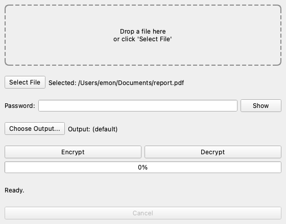

# THEncrypterX

A file encryption tool with authenticated encryption, a password-derived key
(Argon2id), and a versioned binary container format (`.thex`). Ships as a
CLI (`typer`) and a desktop GUI (PySide6).

```bash
thencrypterx encrypt document.pdf
thencrypterx decrypt document.pdf.thex
thencrypterx verify document.pdf.thex
thencrypterx inspect document.pdf.thex
```

## Status

Feature-complete against the [build guide](THEncrypterX_Build_Guide.md)'s v1
scope. 318 tests passing, CI green on Linux/macOS/Windows × Python 3.12/3.13.
See [`docs/ROADMAP.md`](docs/ROADMAP.md) for planned post-v1.0 work.

## Features

- **Authenticated encryption**: XChaCha20-Poly1305 (default) or AES-256-GCM,
  chosen per file and recorded in its header
- **Password-based key derivation**: Argon2id with a random salt per file;
  parameters are versioned and stored alongside the ciphertext
- **Domain-separated subkeys**: metadata and file content are encrypted
  under independent keys derived via HKDF
- **Streaming, bounded-memory processing**: files are read and encrypted in
  fixed-size chunks; memory use does not scale with file size
- **Parallel chunk workers**: `--workers N` seals/opens up to N chunks
  concurrently on a thread pool - both AEAD backends release the GIL during
  their C-level work, so this is real multi-core speedup, not just
  scheduling overhead (measured ~4x throughput at 8 workers on an 8-core
  machine; see Benchmarks). File order is preserved regardless of which
  chunk's computation finishes first, and any worker count can decrypt a
  file produced with any other
- **Tamper detection**: every chunk's position (index + final-flag) is
  cryptographically bound to its content, catching reordering, duplication,
  and truncation - not just content modification
- **Encrypted metadata**: original filename, size, and modification time are
  hidden inside the container, never shown before authentication succeeds
- **Atomic writes**: output is only created/replaced if the whole operation
  succeeds; a crash, exception, or cancellation never leaves a partial file
- **CLI**: `encrypt` / `decrypt` / `verify` / `inspect` / `shred`, with
  password sourcing via environment variable, file, or a no-echo prompt -
  never a plain command-line flag
- **Integrity verification** (`verify`): authenticates a container's header,
  metadata, and every chunk without writing any plaintext anywhere - for
  confirming a backup or transferred file is intact without decrypting it
  to disk
- **GUI**: drag-and-drop, a responsive window (encryption runs on a
  background thread), live progress, and a working Cancel button
- **Best-effort secure deletion** (`shred`), honestly documented as
  best-effort - see the threat model

## Security model

Full details, including exactly what is and is not protected: **[docs/threat-model.md](docs/threat-model.md)**.

In short: Argon2id derives a master key from the password and a random
per-file salt; HKDF splits it into independent metadata/data subkeys; AEAD
(XChaCha20-Poly1305 by default) provides confidentiality and integrity;
every chunk's index and final-flag are bound into its authenticated data, so
tampering with content, order, or completeness is all detected the same way.
See **[docs/cryptography.md](docs/cryptography.md)** for why each primitive
was chosen, and **[docs/security.md](docs/security.md)** for secret-handling
and file-safety engineering notes. The container format is fully specified
in **[docs/file-format.md](docs/file-format.md)**, and the module layout in
**[docs/architecture.md](docs/architecture.md)**. To report a vulnerability,
see **[SECURITY.md](SECURITY.md)**.

## Installation

```bash
git clone https://github.com/Emonemon74/THEncrypterX.git
cd THEncrypterX
python3 -m venv .venv
source .venv/bin/activate        # Windows: .venv\Scripts\activate
pip install -r requirements-dev.txt
```

`requirements.txt` covers the CLI only; `requirements-dev.txt` adds the GUI
(PySide6) and everything needed to run the tests.

### Standalone desktop app (no Python required)

Tagged releases publish a packaged desktop GUI for Linux, macOS, and
Windows, built by `.github/workflows/release.yml` - see the repo's
[Releases page](https://github.com/Emonemon74/THEncrypterX/releases). To
build one yourself instead, see "Building a standalone executable" in
[`CONTRIBUTING.md`](CONTRIBUTING.md).

## Usage

### CLI

```bash
# Encrypt (prompts for a password, twice, with no echo)
thencrypterx encrypt document.pdf
thencrypterx encrypt document.pdf -o secret.thex --aead aes256gcm --chunk-size 4194304

# --workers defaults to your CPU count - pass --workers 1 for the original
# single-threaded behaviour
thencrypterx encrypt large-video.mp4 --workers 8

# Decrypt (default output name comes from the encrypted metadata)
thencrypterx decrypt document.pdf.thex
thencrypterx decrypt document.pdf.thex -o restored.pdf

# Verify a container is intact - authenticates everything, writes nothing;
# needs the password (unlike inspect, since this proves nothing was tampered with)
thencrypterx verify document.pdf.thex

# Inspect a container's header - no password needed, nothing inside is read
thencrypterx inspect document.pdf.thex

# Key-file mode: an alternative to a password (see "Limitations and roadmap"
# below for the risks - there is no way to recover a lost key file)
thencrypterx keygen -o mykey.thexkey
thencrypterx encrypt document.pdf --key-file mykey.thexkey
thencrypterx decrypt document.pdf.thex --key-file mykey.thexkey

# Best-effort overwrite + delete
thencrypterx shred document.pdf --yes
```

Password sourcing, in priority order: `THEX_PASSWORD` environment variable →
`--password-file <path>` → interactive no-echo prompt. There is no
`--password` flag on purpose - it would leak into shell history. `--key-file`
is mutually exclusive with all of the above - see `docs/threat-model.md` for
what a key file changes about the threat model versus a password.

Exit codes: `0` success, `1` unexpected error, `2` wrong password, `3`
corrupt/unsupported container, `4` cancelled.

### GUI

```bash
python main.py
```



Drag a file in (or click "Select File"), type a password, click Encrypt or
Decrypt. Large files run on a background thread - the window stays
responsive, and Cancel actually stops the job.

### Library

```python
from app.files.encrypt import encrypt_file
from app.files.decrypt import decrypt_file

encrypt_file("document.pdf", "document.pdf.thex", "a password")
metadata = decrypt_file("document.pdf.thex", "restored.pdf", "a password")
print(metadata.original_name, metadata.original_size)
```

## File format

`.thex` is a versioned binary container: a plaintext header (magic bytes,
format version, algorithm ids, KDF parameters, salt), an encrypted metadata
section, N encrypted chunks, and a footer. Full byte-offset spec, associated-
data definitions, and a frozen known-answer test vector:
**[docs/file-format.md](docs/file-format.md)**.

## Testing

```bash
pytest                    # full suite, ~1-5s
pytest tests/test_security.py -v   # the 22-case tamper matrix
```

Test suite breakdown (318 tests total):

| Category | File(s) | What it proves |
|---|---|---|
| Crypto primitives | `test_kdf.py`, `test_keys.py`, `test_cipher.py` | Argon2id, HKDF, AEAD wrapper correctness and failure modes |
| Wire format | `test_header.py`, `test_container.py` | Byte-exact pack/parse, strict validation, fuzz-safety against malformed headers |
| Metadata | `test_metadata.py` | Serialization, path-traversal-safe filename sanitization |
| File I/O | `test_files_stream.py`, `test_files_encrypt.py`, `test_files_decrypt.py` | Chunking, atomic writes, full encrypt/decrypt round trips |
| Security matrix | `test_security.py` | 22 documented attack scenarios, each with an expected typed failure |
| Integrity verification | `test_verify.py` | `verify_file` authenticates without writing plaintext; mirrors the tamper matrix against `verify` instead of `decrypt` |
| Property-based | `test_properties.py` | Round-trip and "any single-bit flip is caught" across hundreds of generated inputs (Hypothesis) |
| Parser fuzzing | `test_fuzz_parser.py` | Arbitrary/unstructured bytes at every parser entry point (header, footer, metadata, chunk framing, and a whole-file fuzz via `verify`) never crash, hang, or over-allocate |
| Known-answer vector | `test_kat.py` | A frozen container that must always decode identically - a compatibility guardrail |
| CLI / core / GUI | `test_cli.py`, `test_core_*.py`, `test_gui_main_window.py` | Argument handling and exit codes, job/progress/cancellation wiring, the PySide6 window (headless, `pytest-qt`) |

CI runs the same suite plus `ruff` and `mypy` on every push, across
Linux/macOS/Windows and Python 3.12/3.13.

See **[CONTRIBUTING.md](CONTRIBUTING.md)** and **[docs/development.md](docs/development.md)**
for the full dev setup, linting, benchmark, and PR workflow.

## Benchmarks

Full measured numbers (throughput by file size/algorithm, memory, and
`--workers` scaling) live in **[docs/performance.md](docs/performance.md)**,
reproducible via `benchmarks/benchmark_files.py`. Headline result: XChaCha20-
Poly1305 benchmarks ~10x slower than AES-256-GCM on hardware with AES
acceleration, and is still the default - see
[docs/threat-model.md](docs/threat-model.md#why-xchacha20-poly1305-is-the-default-despite-being-much-slower-here)
for why. `--workers` gives ~4x measured encrypt throughput at 8 workers on
an 8-core machine.

## Limitations and roadmap

- File size is not hidden (no padding to fixed buckets)
- Secure deletion is best-effort only - not guaranteed on SSDs, CoW
  filesystems, or where backups/snapshots exist (see threat model)
- No password-strength checking
- Key-file mode has no recovery path if the key file is lost - see
  `docs/threat-model.md` for what that changes versus a password
- Parallel workers (`--workers`) only pipeline chunk-level AEAD calls, not
  the Argon2id key derivation itself (a fixed cost per operation) or disk
  I/O beyond the OS's own buffering
- No resumable encryption/decryption - an interrupted operation on a huge
  file never leaves partial output (all-or-nothing by design), but
  restarting means starting over, not resuming (see
  `docs/architecture.md#large-file-handling`)
- No post-quantum primitives
- No multi-recipient / key-sharing support

## Contributing

See [CONTRIBUTING.md](CONTRIBUTING.md) for the dev workflow, and
[CHANGELOG.md](CHANGELOG.md) for release history. To report a security
vulnerability, see [SECURITY.md](SECURITY.md) - not a public issue.

## License

MIT - see [LICENSE](LICENSE).
